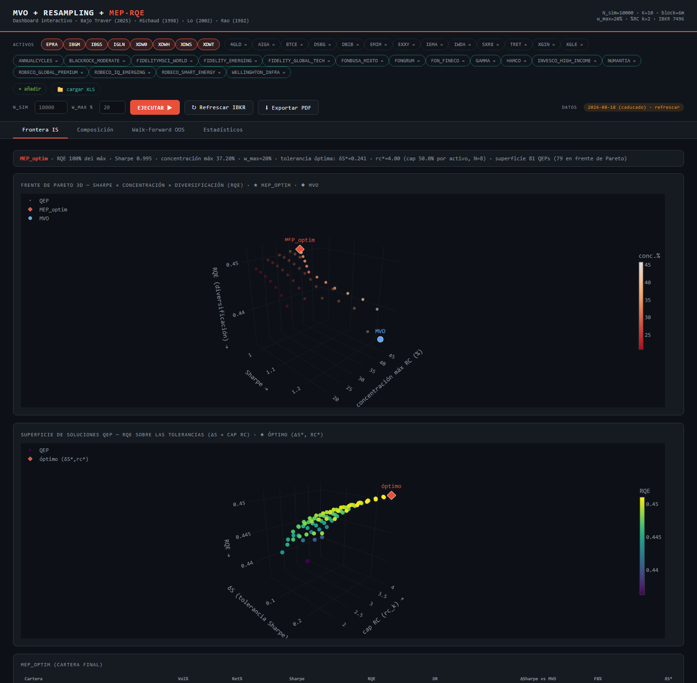
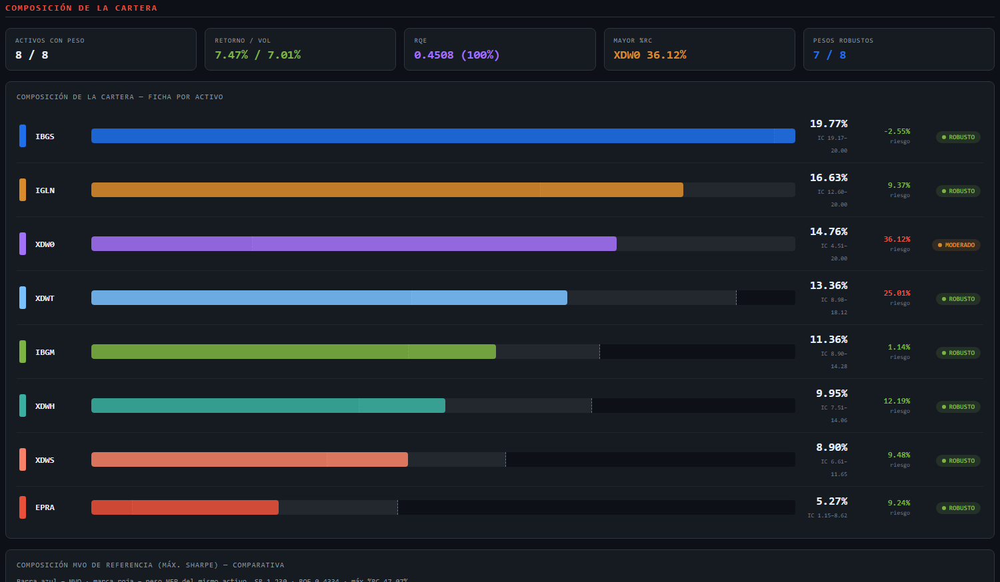
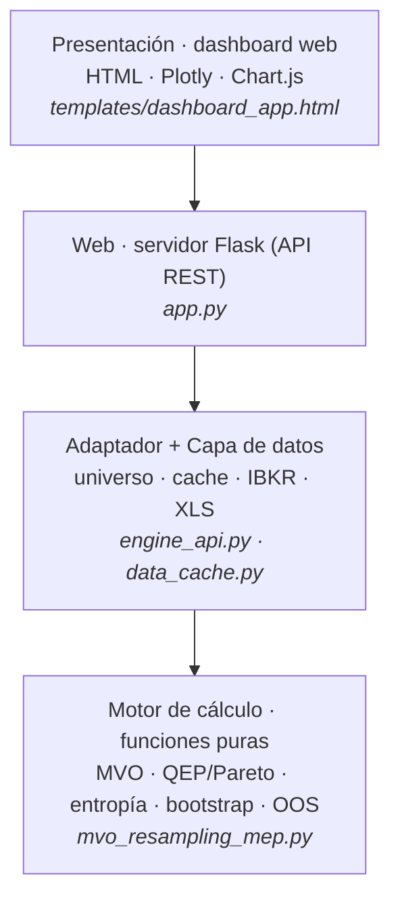

# Optimizador cuantitativo de carteras: MVO · Resampling · MEP·RQE

Optimizador de carteras multiactivo que va más allá del máximo Sharpe: **maximiza la
diversificación estructural** mediante la cartera de máxima entropía de Rao (MEP·RQE),
combinada con el resampling de Michaud para ganar estabilidad. Incluye una **aplicación web
interactiva** (Flask + Plotly) conectada a Interactive Brokers, con validación
*walk-forward* fuera de muestra.

Implementación del modelo del **Máster en Finanzas Cuantitativas (MFIA)**, que extiende a un
universo multiactivo el marco de máxima entropía de **Bajo Traver (2025, _Journal of Asset
Management_)**. Metodología y resultados completos, en el paper; este repositorio es el
software (motor + aplicación).

**Stack:** Python · NumPy · SciPy · pandas · Flask · Plotly · Chart.js · ib_insync ·
multiprocessing.

---

## El aplicativo

Dashboard interactivo para seleccionar el universo, ejecutar el modelo y explorar los
resultados. La vista principal muestra el **frente de Pareto 3D** y la **superficie de
carteras cuasi-eficientes (QEP)**, con el óptimo (`MEP_optim`) y el MVO marcados.





---

## Cómo funciona (resumen)

Sobre la frontera media-varianza (MVO) se barre una rejilla de tolerancias para formar una
**superficie de carteras cuasi-eficientes (QEP)**; su **frente de Pareto** (diversificación
· Sharpe · concentración) selecciona la cartera de **máxima diversificación dentro de una
banda de eficiencia**. La diversificación se mide con la **entropía cuadrática de Rao**. La
solución se estabiliza por **resampling** (Stationary Block Bootstrap) y se valida
**fuera de muestra** (walk-forward).

## Resultado

En validación *walk-forward* fuera de muestra, la cartera MEP·RQE **mantiene el ratio de
Sharpe** de la optimización media-varianza **reduciendo la volatilidad y el máximo
drawdown**, y supera a la cartera equiponderada (1/N). En otras palabras: mayor
diversificación y un perfil de riesgo más contenido **a igualdad de eficiencia**, sin coste
de rentabilidad ajustada por riesgo estadísticamente detectable.

---

## Arquitectura

Diseño **por capas con dependencias unidireccionales**: la lógica científica (motor) queda
separada de los datos y la presentación, y tanto la app como la ejecución por lotes invocan
el mismo pipeline (una única fuente de verdad, resultados reproducibles).



| Módulo | Rol |
|---|---|
| `mvo_resampling_mep.py` | Motor: pipeline científico completo (funciones puras) |
| `engine_api.py` | Adaptador app ↔ motor; devuelve el payload JSON del dashboard |
| `data_cache.py` | Universo, cache de precios (TTL 1 día), alta IBKR e ingesta XLS/CSV |
| `app.py` | Servidor Flask (API REST) que sirve el dashboard |
| `templates/dashboard_app.html` | Dashboard interactivo (Plotly + Chart.js) |

---

## Uso

Requiere Python 3.11+. Para descargar precios en vivo, la estación de **Interactive Brokers
(TWS o IB Gateway)** debe estar abierta con la API habilitada; si hay cache del día, corre
sin conexión.

```bash
pip install -r requirements.txt
python app.py            # dashboard en http://127.0.0.1:5000
```

---

## Referencias

Métodos descritos en la literatura académica (obra de sus autores; aquí se implementan y se
citan): Bajo Traver (2025); Markowitz (1952); Michaud (1989, 1998); Rao (1982); Gower
(1966); López de Prado (2016, 2019); Lo (2002); Politis & Romano (1994); Jagannathan & Ma
(2003); DeMiguel, Garlappi & Uppal (2009); Maillard, Roncalli & Teïletche (2010); Bailey &
López de Prado (2012, 2014); Jobson & Korkie (1981); Memmel (2003).

---

## Licencia

© 2026 **Carles Aznar Carrique (MFIA)**. Todos los derechos reservados. Ver
[`LICENSE`](LICENSE). Repositorio publicado **solo para consulta y referencia** (TFM y
portfolio profesional): no se concede permiso para usar, copiar, modificar ni redistribuir
el código sin autorización escrita del autor. El copyright cubre el código fuente original;
los métodos teóricos pertenecen a sus respectivos autores.

---

> **Aviso.** Herramienta de investigación basada en modelos estadísticos. **No constituye
> asesoramiento financiero ni recomendación de inversión**, ni una oferta o solicitud para
> comprar o vender ningún instrumento financiero. Las rentabilidades pasadas o simuladas no
> garantizan resultados futuros; toda inversión conlleva riesgo, incluida la posible pérdida
> del capital. El uso de esta herramienta es responsabilidad exclusiva del usuario.
