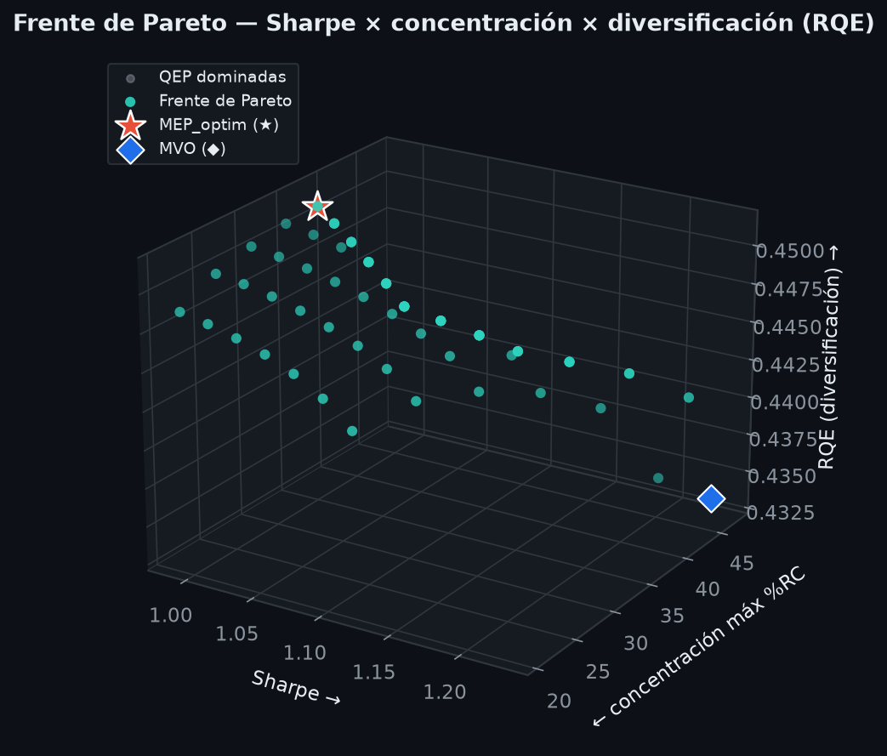
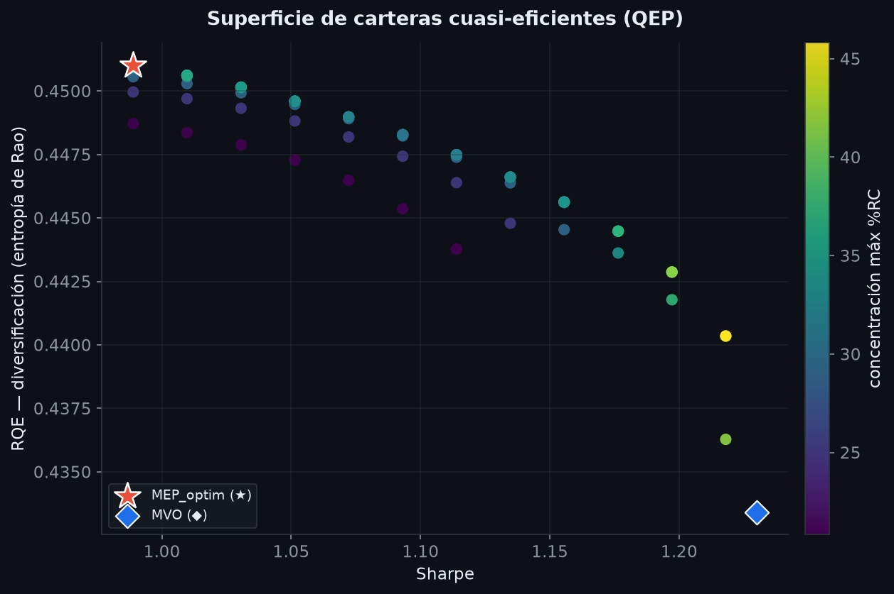
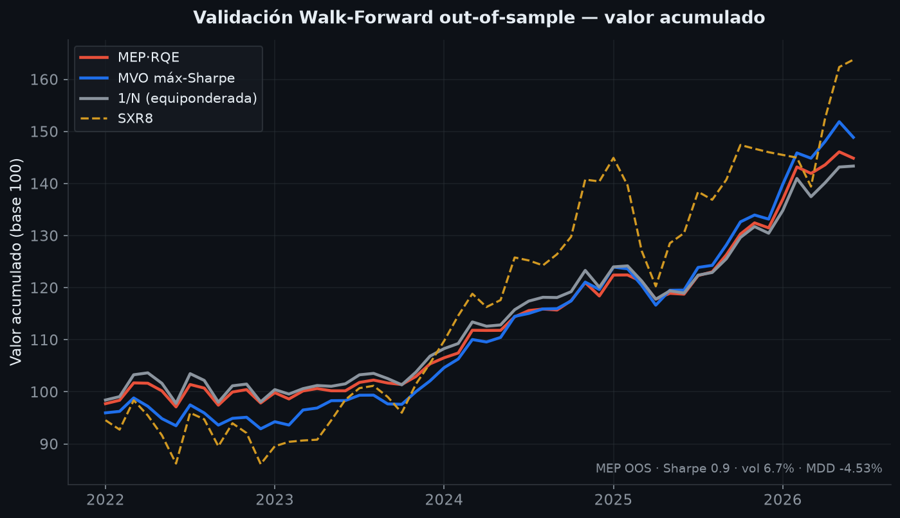
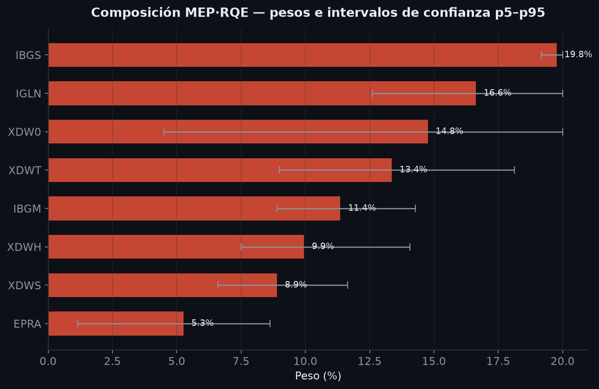

# Optimizador cuantitativo de carteras — MVO · Resampling · MEP·RQE

> Motor de construcción robusta de carteras multiactivo que combina la optimización
> media-varianza de Markowitz con el resampling de Michaud y la **cartera de máxima
> entropía de Rao (MEP·RQE)**, con validación *walk-forward* fuera de muestra y una
> batería de contrastes de robustez estadística (Jobson-Korkie, PSR y DSR). Incluye una
> aplicación web interactiva (Flask + Plotly) conectada en tiempo real a Interactive
> Brokers.

Trabajo desarrollado en el marco del **Máster en Finanzas Cuantitativas (MFIA)**. El
modelo extiende a un universo multiactivo el marco de máxima entropía de **Bajo Traver
(2025, _Journal of Asset Management_)**.

**Stack:** Python · NumPy · SciPy (optimización no lineal SLSQP) · pandas · Flask ·
Plotly · Chart.js · ib_insync (API Interactive Brokers) · multiprocessing.

---

## Tabla de contenidos

1. [Motivación financiera](#1-motivación-financiera)
2. [El modelo, paso a paso](#2-el-modelo-paso-a-paso)
3. [Validación y robustez estadística](#3-validación-y-robustez-estadística)
4. [Resultados](#4-resultados)
5. [Arquitectura del software](#5-arquitectura-del-software)
6. [Estructura del repositorio](#6-estructura-del-repositorio)
7. [Instalación y uso](#7-instalación-y-uso)
8. [El dashboard](#8-el-dashboard)
9. [Configuración](#9-configuración)
10. [Referencias](#10-referencias)
11. [Licencia](#11-licencia)

---

## 1. Motivación financiera

La optimización media-varianza clásica (**MVO**, Markowitz 1952) es, en la práctica,
notoriamente inestable. Exige invertir la matriz de covarianzas y estimar retornos
esperados; cuando los activos están muy correlacionados —lo habitual en carteras
multiactivo y, sobre todo, en renta fija— la matriz está mal condicionada y la solución
se vuelve extremadamente sensible al error de estimación: pequeños cambios en los inputs
producen carteras radicalmente distintas y concentradas (la «maldición de Markowitz»,
Michaud 1989). El resultado es que, fuera de muestra, la MVO suele ser batida incluso por
la cartera ingenua 1/N (DeMiguel, Garlappi & Uppal 2009).

Este proyecto aborda el problema por dos vías complementarias:

- **Resampling** (Michaud 1998): en lugar de confiar en una única estimación puntual de
  μ y Σ, se remuestrea la historia muchas veces y se agregan las carteras resultantes,
  obteniendo pesos más estables y con intervalos de confianza.
- **Máxima entropía de Rao (MEP·RQE)**: en lugar de perseguir el máximo Sharpe, se
  **maximiza la diversificación estructural** —medida por la entropía cuadrática de Rao,
  que penaliza la similitud entre activos— sujeta a permanecer dentro de una banda
  estadística de eficiencia respecto al óptimo media-varianza.

La tesis subyacente: se puede alcanzar una diversificación muy superior **sin coste de
eficiencia estadísticamente detectable** frente a la MVO.

---

## 2. El modelo, paso a paso

El pipeline encadena cuatro fases:

### 2.1. MVO base

Se construye la frontera eficiente y se identifica su **cartera tangente** (máximo
Sharpe), que actúa como referencia de eficiencia. El tipo libre de riesgo es el **€STR**.

### 2.2. Superficie QEP + frente de Pareto (selección de tolerancias)

En vez de un único punto, se barre una rejilla de tolerancias sobre dos ejes:

- **δS** — banda de Sharpe: cuánto se permite alejarse del Sharpe del MVO tangente. Se
  calibra estadísticamente vía el error del Sharpe (Lo 2002).
- **rc_k** — cap de contribución al riesgo por activo (límite %RC ≤ rc_k/N), que controla
  la concentración (lógica de risk budgeting, Roncalli).

Cada celda `(δS, rc_k)` resuelve una cartera de máxima entropía factible → se obtiene una
**superficie de carteras cuasi-eficientes (QEP)**. Sobre ella se construye el **frente de
Pareto** en tres objetivos —diversificación (RQE ↑), Sharpe ↑, concentración ↓— y se
selecciona el punto de **máxima diversificación dentro de la banda** (criterio `MEP_max`,
sin pesos de preferencia). Esta receta se recalcula en cada ejecución (in-sample y en cada
paso out-of-sample).

### 2.3. El bloque de construcción: entropía de Rao

La cartera de máxima entropía maximiza la **entropía cuadrática de Rao**:

```
H_D(w) = ½ · wᵀ D̃ w
```

donde `w` son los pesos y `D̃` es una matriz de disimilitud construida en dos pasos
(Bajo Traver 2025, Eqs. 5-7):

1. **Distancia de Gower** (Gower 1966): `d_ij = √((1 − ρ_ij) / 2)`, que transforma la
   correlación en una métrica válida.
2. **«Distancia de distancias»** (López de Prado): `d̃_ij = ‖D_i − D_j‖₂`, la distancia
   euclídea entre columnas de la matriz de distancias. Mientras `d_ij` mira solo el par
   `(i, j)`, `d̃_ij` compara cómo se relaciona cada activo con **todo** el universo: dos
   activos son próximos si se comportan de forma parecida frente a los demás.

La maximización se resuelve por **SLSQP con gradiente analítico** `∇H_D = D̃w` y
multi-arranque (el primer punto es la cartera MVO; el resto, aleatorios de una Dirichlet)
para mitigar la no convexidad, sujeta al presupuesto (Σw=1), a la banda de Sharpe (por
ambos lados) y al cap de contribución al riesgo.

### 2.4. Resampling: Stationary Block Bootstrap

Fijada la tolerancia `(δS*, rc_k*)` elegida en el frente de Pareto, se corre el
**Stationary Block Bootstrap** (Politis & Romano 1994): se remuestrean bloques de longitud
geométrica (media 6 meses, circular) que **preservan la autocorrelación, los clusters de
volatilidad y las colas gruesas** de las series —cosa que un Monte Carlo gaussiano no hace—.
Cada remuestra resuelve el mismo problema de entropía; se agrega por **mediana de pesos** y
se reportan **intervalos de confianza p5–p95** por activo.

---

## 3. Validación y robustez estadística

### 3.1. Walk-forward out-of-sample

Esquema de ventana deslizante sin *look-ahead*: en cada fecha de recomposición
(trimestral) se estima y se ejecuta el modelo completo con los 60 meses previos; los pesos
se mantienen el tramo siguiente, que constituye el out-of-sample. Los tramos se concatenan
en una única serie OOS sobre la que se calculan las métricas (netas de costes de
transacción). Dentro de cada tramo los pesos **derivan con el mercado** y solo se
restablecen en el siguiente rebalanceo.

### 3.2. Contrastes

- **Jobson-Korkie / Memmel** — contraste de igualdad de ratios de Sharpe entre el MEP y su
  benchmark (MVO), corrigiendo por la correlación entre ambas series.
- **PSR — Probabilistic Sharpe Ratio** (Bailey & López de Prado 2012) — probabilidad de
  que el Sharpe verdadero supere un umbral, corrigiendo por tamaño muestral y no-normalidad
  (asimetría y curtosis). Se aplica a la serie OOS del MEP.
- **DSR — Deflated Sharpe Ratio** (Bailey & López de Prado 2014) — corrige el **sesgo de
  selección**: dado que el modelo elige la mejor cartera entre las N candidatas de la
  superficie QEP, el DSR deflacta el Sharpe por esa multiplicidad para descartar que el
  resultado sea fruto del sobreajuste de la búsqueda.

---

## 4. Resultados

Validación *walk-forward* sobre el núcleo multiactivo (T ≈ 115 meses):

| Estrategia | Sharpe OOS | Volatilidad | Máx. drawdown |
|---|---|---|---|
| **MEP·RQE** | ≈ 0,90 | menor | **menor** |
| MVO máx-Sharpe | ≈ 0,90 | mayor | mayor |
| 1/N (equiponderada) | inferior | — | — |

- El MEP **iguala** al MVO en Sharpe (contraste de Jobson-Korkie **no significativo**) con
  **menor volatilidad y menor drawdown**, y bate a la 1/N.
- **Robustez estadística:** PSR ≈ 0,97 (el Sharpe OOS es significativamente positivo) y
  DSR ≈ 0,99 (el resultado sobrevive a la deflación por multiplicidad de búsquedas).

**Lectura:** el MEP no promete más rentabilidad; entrega la misma eficiencia con **mayor
diversificación estructural y un perfil de riesgo más contenido**, sin coste de eficiencia
estadísticamente detectable.

### Galería

**Frente de Pareto** (Sharpe × concentración × diversificación RQE). El `MEP_optim` (★)
maximiza la diversificación; el MVO (◆) maximiza el Sharpe a costa de concentrarse.



**Superficie de carteras cuasi-eficientes (QEP)** — el trade-off Sharpe ↔ diversificación,
coloreado por concentración (%RC máx.).



**Validación Walk-Forward OOS** — valor acumulado del MEP frente a MVO, 1/N y el índice de
referencia. MEP, MVO y 1/N prácticamente solapados (eficiencia equivalente); el índice
puro de renta variable oscila mucho más.



**Composición del MEP** — pesos e intervalos de confianza p5–p95 obtenidos por resampling.



---

## 5. Arquitectura del software

El sistema sigue una **arquitectura por capas con dependencias unidireccionales** (cada
capa depende solo de las inferiores). El principio rector es la **separación entre la
lógica científica y las capas de datos y presentación**: el motor es un módulo autónomo de
funciones puras, y tanto la ejecución por lotes como la aplicación web invocan
**exactamente el mismo pipeline** (una única fuente de verdad → resultados reproducibles).

```
┌───────────────────────────────────────────────┐
│  Presentación — dashboard en el navegador       │  templates/dashboard_app.html
│  (HTML + JavaScript · Plotly · Chart.js)        │
└───────────────────────┬─────────────────────────┘
                        │  REST / JSON
┌───────────────────────▼─────────────────────────┐
│  Web — servidor Flask (API REST, sin estado)     │  app.py
└───────────────────────┬─────────────────────────┘
                        │
┌───────────────────────▼─────────────────────────┐
│  Adaptador          ·          Capa de datos     │  engine_api.py · data_cache.py
│  (orquesta y        │  (universo, cache de        │
│   serializa)        │   precios, IBKR, XLS)       │
└───────────────────────┬─────────────────────────┘
                        │
┌───────────────────────▼─────────────────────────┐
│  Motor de cálculo — funciones puras               │  mvo_resampling_mep.py
│  (MVO · QEP/Pareto · entropía · bootstrap · OOS)  │
└───────────────────────────────────────────────────┘
```

**`mvo_resampling_mep.py` — núcleo científico.** Colección de funciones puras (sin estado
global salvo el diccionario `CONFIG`). Contiene todo el pipeline: estimación de parámetros,
`solve_mep` (bloque de construcción de entropía), construcción de la superficie QEP y el
frente de Pareto, `run_mep_optim` (receta completa), resampling y `run_walk_forward`
(validación OOS), además de los estadísticos de robustez (Jobson-Korkie, PSR/DSR). El
barrido de la rejilla de tolerancias es *embarrassingly parallel*: cada celda se resuelve
en un proceso separado vía `multiprocessing`.

**`engine_api.py` — adaptador.** Desacopla la web del motor. `run_optimization(df_prices,
tickers, overrides)` ejecuta el pipeline sobre el subconjunto de activos seleccionado y
devuelve un **payload JSON** con la composición final (mediana + IC p5–p95), la superficie
QEP con las marcas de Pareto, la cartera MVO de referencia, la validación OOS y la robustez
PSR/DSR. No reescribe lógica científica: orquesta y serializa.

**`data_cache.py` — capa de datos.** Aísla la adquisición y persistencia: universo
persistente (`universe.json`), cache de precios mensual con **caducidad de 1 día**
(reproducibilidad offline sin tocar IBKR), alta de tickers contra IBKR (`ib_insync`) e
ingesta robusta de fondos externos por **XLS/CSV** (autodetecta niveles vs. retornos,
frecuencia diaria/mensual, formato numérico español y limpia *spikes* de datos corruptos).

**`app.py` — servidor Flask.** API REST minimalista y sin estado (el único estado es la
cache en disco). Se ejecuta en un único hilo (`threaded=False`) porque el cliente de IBKR
requiere un *event loop* de asyncio en el hilo que llama, y con el reloader desactivado
(necesario por el uso de `multiprocessing` en Windows).

### Endpoints

| Método | Ruta | Función |
|--------|------|---------|
| GET  | `/api/state` | Universo + estado del cache + configuración |
| POST | `/api/optimize` | `{tickers, config}` → payload del dashboard |
| POST | `/api/refresh` | Fuerza descarga IBKR del universo completo |
| GET  | `/api/search?q=` | Busca símbolos en IBKR |
| POST | `/api/add_ticker` | Alta de un ticker nuevo |
| POST | `/api/remove` | Baja de un ticker (no núcleo) |
| POST | `/api/upload_xls` | Carga fondos desde XLS/CSV |
| POST | `/api/remove_external` | Quita un fondo XLS |
| POST | `/api/export_pdf` | Exporta el último resultado a PDF (Edge headless) |

---

## 6. Estructura del repositorio

```
mvo_resampling_mep.py    Motor: pipeline científico completo (funciones puras)
engine_api.py            Adaptador app ↔ motor (payload JSON)
data_cache.py            Universo + cache de precios (TTL 1 día) + IBKR + XLS
app.py                   Servidor Flask (API REST + dashboard)
templates/
  dashboard_app.html     Dashboard interactivo (Plotly + Chart.js)
buscar_rf.py             Utilidad de descarga del tipo libre de riesgo
docs/img/                Figuras del README
requirements.txt         Dependencias
```

---

## 7. Instalación y uso

**Requisitos:** Python 3.11+. Para descargar/refrescar precios de mercado, la estación de
trabajo de **Interactive Brokers (TWS o IB Gateway)** debe estar abierta y con la API
habilitada (por defecto, puerto `7496`).

```bash
pip install -r requirements.txt

# (a) Aplicación web interactiva:
python app.py                 # abre http://127.0.0.1:5000

# (b) Pipeline por lotes (mismo motor; genera Excel + PNG + dashboard estático):
python mvo_resampling_mep.py
```

Si existe cache de precios del día, el modelo se ejecuta **sin conexión**. El servidor
Flask es de un solo hilo: mientras corre una optimización (usa todos los núcleos) no
atiende otras peticiones —espera a ver `POST /api/optimize … 200` en el terminal—.

---

## 8. El dashboard

Aplicación web local con cuatro pestañas:

1. **Frontera IS** — KPIs (retorno, volatilidad, Sharpe, RQE), **superficie QEP** y
   **frente de Pareto 3D** (Sharpe × concentración × RQE) con el `MEP_optim` y el MVO
   marcados (Plotly interactivo).
2. **Composición** — ficha por activo: peso, intervalo de percentiles p5–p95, contribución
   al riesgo (%RC) con semáforo y clasificación de estabilidad.
3. **Walk-Forward OOS** — métricas de MEP/MVO/1-N, curva de valor acumulada, drawdown y
   contraste de Jobson-Korkie.
4. **Estadísticos** — tabla de métricas, parámetros del modelo y bloque de **robustez
   PSR/DSR**.

Funcionalidades: selección dinámica del universo, alta de tickers contra IBKR, **carga de
fondos por XLS/CSV**, *ablation study* sin límite de peso (para aislar el efecto de la
entropía), exportación a PDF y cache de precios con caducidad de un día.

---

## 9. Configuración

Todos los parámetros se centralizan en el diccionario `CONFIG` de `mvo_resampling_mep.py`:
ventana histórica, `min_obs`, `w_max` (cap de peso, Jagannathan & Ma 2003), rejilla de
`δS × rc_k`, número de simulaciones bootstrap, longitud de bloque, tipo libre de riesgo,
ventana y frecuencia de rebalanceo del walk-forward, etc. Cualquier ejecución es
completamente parametrizable, y los `overrides` del adaptador permiten sobrescribir
`CONFIG` por petición sin tocar el global.

---

## 10. Referencias

Los métodos implementados están descritos en la siguiente literatura académica (obra de
sus respectivos autores; aquí solo se implementan y se citan):

- **Bajo Traver, M. (2025).** Enhancing diversification in fixed-income portfolios: an
  entropy-based optimization framework. _Journal of Asset Management._ — *paper principal.*
- **Markowitz, H. (1952).** Portfolio Selection. _Journal of Finance._
- **Michaud, R. O. (1989, 1998).** The Markowitz Optimization Enigma / Efficient Asset
  Management. — *resampling.*
- **Rao, C. R. (1982).** Diversity and dissimilarity coefficients: a unified approach.
  — *entropía cuadrática.*
- **Gower, J. C. (1966).** Some distance properties of latent root and vector methods.
  _Biometrika._ — *distancia.*
- **López de Prado, M.** Building Diversified Portfolios that Outperform Out-of-Sample
  (HRP, 2016); A Robust Estimator of the Efficient Frontier (NCO, 2019). — *distancia de
  distancias, robustez.*
- **Lo, A. W. (2002).** The Statistics of Sharpe Ratios. _Financial Analysts Journal._
  — *calibración de δS y error del Sharpe.*
- **Politis, D. N. & Romano, J. P. (1994).** The Stationary Bootstrap. _JASA._
- **Jagannathan, R. & Ma, T. (2003).** Risk reduction in large portfolios: why imposing the
  wrong constraints helps. _Journal of Finance._ — *cap de peso.*
- **DeMiguel, V., Garlappi, L. & Uppal, R. (2009).** Optimal versus naive diversification.
  _Review of Financial Studies._
- **Maillard, S., Roncalli, T. & Teïletche, J. (2010).** The properties of equally weighted
  risk contribution portfolios. — *contribución al riesgo.*
- **Bailey, D. H. & López de Prado, M. (2012, 2014).** The Sharpe Ratio Efficient Frontier
  (PSR) / The Deflated Sharpe Ratio (DSR). — *robustez estadística.*
- **Jobson, J. D. & Korkie, B. (1981); Memmel, C. (2003).** Contrastes de igualdad de
  Sharpe.

---

## 11. Licencia

© 2026 **Carles Aznar Carrique (MFIA)**. Todos los derechos reservados. Ver
[`LICENSE`](LICENSE).

Este repositorio se publica **únicamente para consulta, evaluación y referencia académica**
(TFM y portfolio profesional). No se concede permiso para usar, copiar, modificar o
redistribuir el código sin autorización escrita del autor. El copyright cubre el **código
fuente original**; los métodos teóricos subyacentes pertenecen a sus respectivos autores
(ver Referencias).
